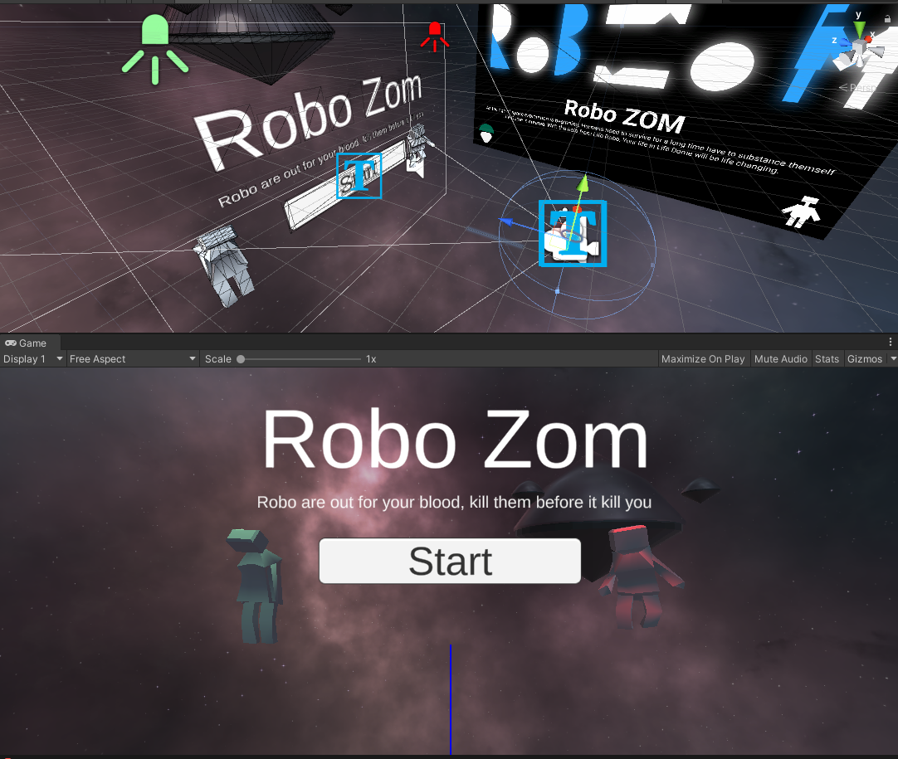
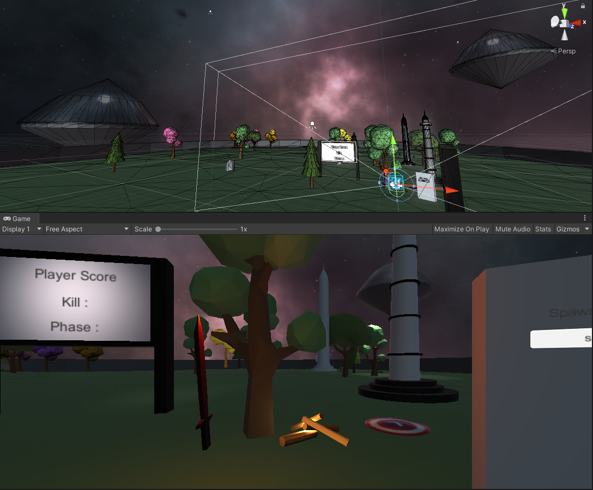
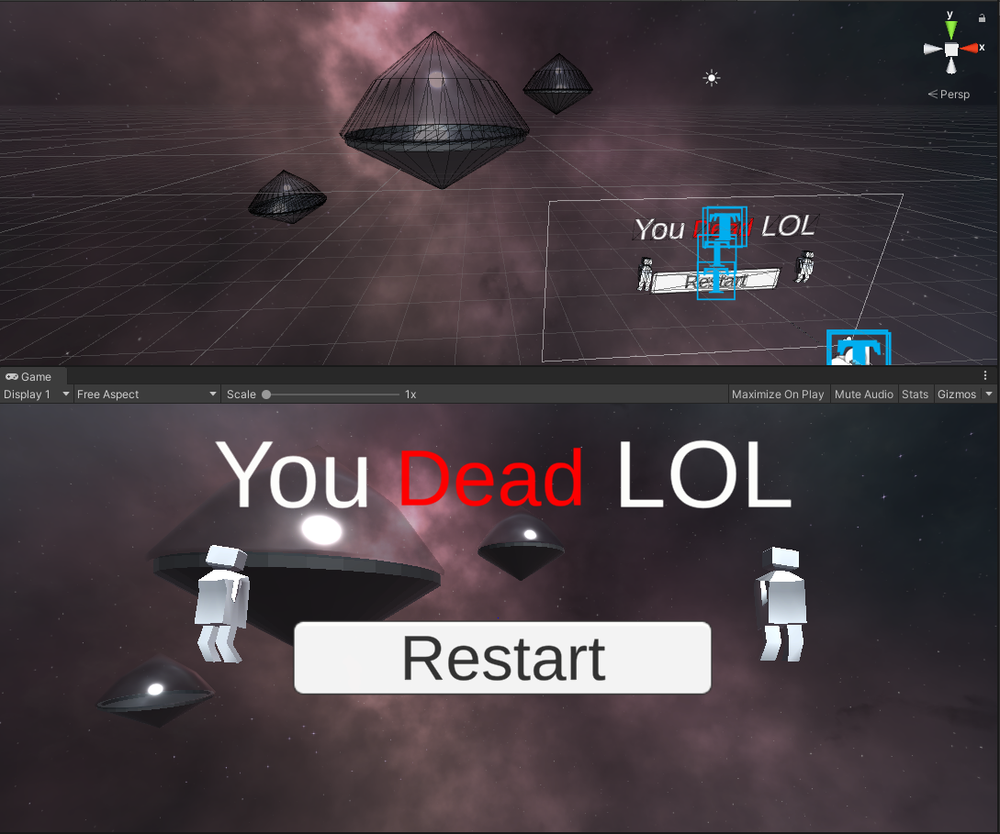

# ROBO ZOM is a VR game made to learn about the basics of XR in unity 
## Clone and open in Unity 

## Some of the Screen Shot of the game.
### Menu 

### Level

### Dead 

## Feature of the game.
- VR.
- Can interact with game object using grap trigger in VR controller.

## Game Play 
- Grab stone or sword and start killer enemy 
- There are 3 phases in-game, with each one the spawn rate increases 

